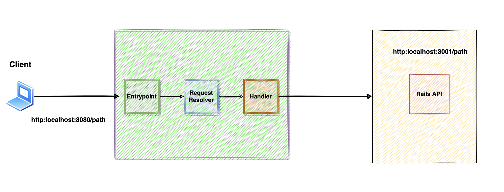

# Shop API Cloud Functions

### High level architecture diagram:

Example GCP cloud functions app created for the following blog post.

Link TBA

This cloud function app connects to the Shop API application

https://github.com/ajazfarhad/shop-api

## Development
Use the following command to run the local web server:
``bundle exec functions-framework-ruby --target shop-api-function``
Default port number is ``8080``, but you can override it by specifying `` --port=3000`` argument.
